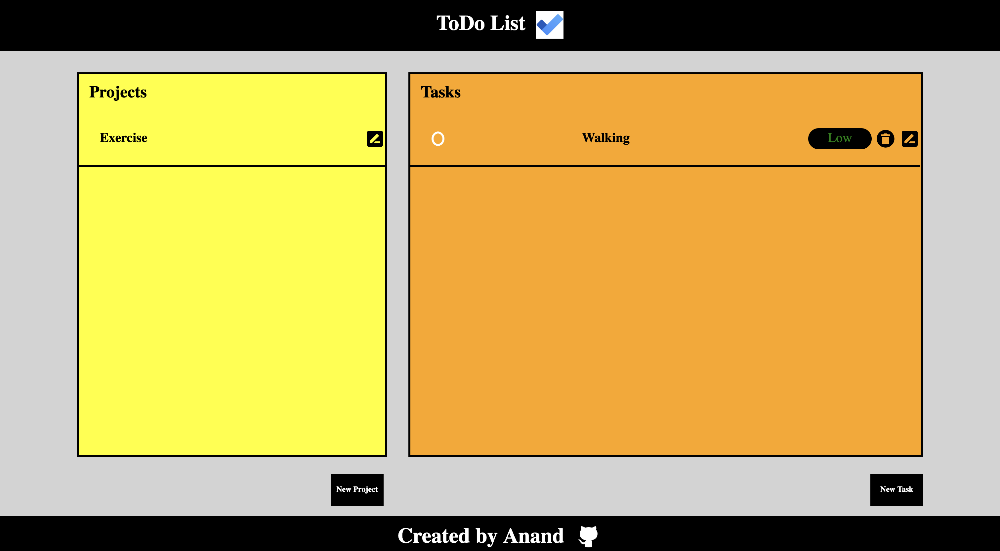

# todo-list
This project is a todo-list which is used to add tasks which have to be done as reminders.

In this project multiple tasks which are to be done can be added to a list based on their priority.
Multiple information fields like duedate,description,name of the task can also be added.

When the todo list is completed it can be marked as completed by clicking on the circle

This project was made with the aim to practice Webpack,Object Oriented Programming,dividing code into different modules.

The demonstration of the website can be found on https://anandb104.github.io/todo-list/

